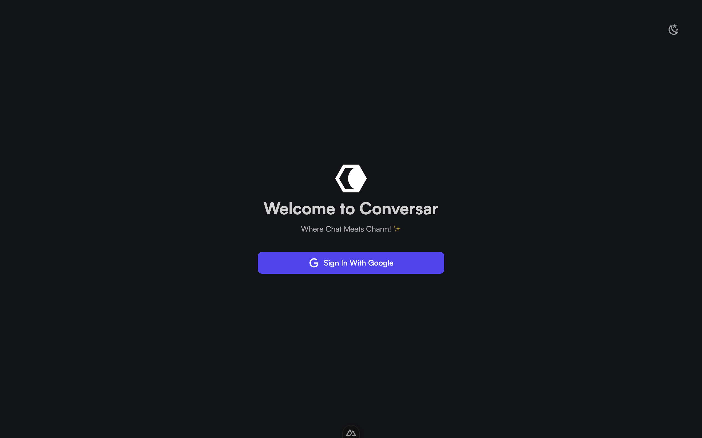

# Conversar

<p align='center'>
  
</p>

<br/>


<p align='center'>
<a href="https://conversar.vercel.app/">Live Demo</a>
</p>

<br>

<!-- omit in toc -->
## Table of Contents

- [Features](#features)
- [Usage](#usage)
- [Why](#why)
- [Acknowledgments](#acknowledgments)

## Features

- [💚 Nuxt 3](https://nuxt.com/) - SSR, ESR, File-based routing, components auto importing, modules, etc.

<!-- - ⚡️ Vite - Instant HMR -->

- 🍍 [State Management via Pinia](https://pinia.vuejs.org/)

<!-- - 📲 [PWA](https://github.com/antfu/vite-plugin-pwa) -->

- 🎨 [TailwindCSS](https://tailwindcss.com/)

- 😃 [Use icons from Iconify](https://iconify.design)

- 🔥 Use the [new `<script setup>` syntax](https://github.com/vuejs/rfcs/pull/227)

- 📥 APIs auto importing - use Composition API and others directly

- 🦾 TypeScript, of course

<br>

## Usage

### Development

Just run and visit http://localhost:3000

```bash
pnpm dev
```

OR

```bash
yarn dev
```

### Build

To build the App, run

```bash
pnpm build
```

OR

```bash
yarn build
```

And you will see the generated file in `dist` that is ready to be served.

### Deploy

Deploy anywhere.

## Why

Just trying my hands out on new tools.


## Acknowledgments

I would like to express my gratitude to the following individuals:

- **Friends and Family**: This wouldn't have been possible without support from friends and family, I really appreciate y'all.

- **Myself**: Lastly, I want to thank [me](https://www.youtube.com/watch?v=wGRF3GQ4Wdk).